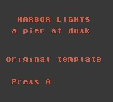
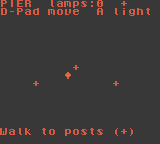

# Handheld Forge

Cursor plugin that turns a lore-first brief into a polished 2D handheld ROM (`.gbc` via GBDK-2020 in v0; `.gba` planned later). Prompt → scaffold → build → headless PyBoy playtest → optional (locked) arcade publish / device push.

**Depth over a two-minute loop:** title and premise cards, in-character lore cards with readable sprites, then a playable slice – under a harsh pixel Visual Bar at 160×144.

Brand / product id: `handheld-forge` (Game Forge – Make).

## Install

### Local test (today)

```bash
mkdir -p ~/.cursor/plugins/local
ln -s /absolute/path/to/handheld-forge ~/.cursor/plugins/local/handheld-forge
# Restart Cursor or Developer: Reload Window
# Confirm under Customize that skills + commands appear
```

Symlinks only load when the target resolves inside `~/.cursor/plugins/local` on some setups – if reload skips it, copy the repo into that folder instead.

### Marketplace (later)

Submit at [cursor.com/marketplace/publish](https://cursor.com/marketplace/publish). Until listed, use the local path above.

### Toolchain on the machine

```bash
./scripts/setup.sh          # GBDK-2020 → /opt/gbdk (or tools/gbdk) + .venv-pyboy
./scripts/build.sh          # builds templates/gbc-gbdk-minimal
./scripts/playtest.py --rom templates/gbc-gbdk-minimal/build/harbor_lights_v0.1.gbc --out qa
```

## Commands

| Command | Status | Role |
|---|---|---|
| `/new-game` | active | Stage A – BRIEF, PLAN, BAR, GBDK scaffold |
| `/build` | active | Compile versioned `build/<slug>_vX.Y.gbc` |
| `/playtest` | active | Headless PyBoy cards + play smoke (cap 10–15 emulated minutes) |
| `/publish-to-arcade` | **LOCKED** | Unlock with `HANDHELD_FORGE_UNLOCK_PUBLISH=1` |
| `/install-on-device` | **LOCKED** | Unlock with `HANDHELD_FORGE_UNLOCK_DEVICE=1` |

The skill `handheld-forge` is the Orchestrator constitution (Planner / Builder / Critic / Diagnoser). Slash commands are thin stage wrappers – see `skills/handheld-forge/SKILL.md`.

## Loop

```
/new-game  →  edit lore + loop  →  /build  →  /playtest  →  Critic rounds
                 ↑_________________________________________|
```

Send-to-handheld stays human-gated. Preferred order when unlocked: cloud push inbox (`GAMEFORGE_SENDER_TOKEN`) → `gameforge-device push` → Syncthing folder **only after asking where to write**.

## Locked features

### Publish to arcade

Needs `HANDHELD_FORGE_UNLOCK_PUBLISH=1`, plus `GAMEFORGE_API_BASE` and `GAMEFORGE_PUBLISHER_TOKEN` (`gfp_…`). Flow: `POST /v1/publish` → `PUT` uploads → `POST …/complete` → `pending_review`. Originals only (`isFanDemake: false`), `aiDisclosure` required, platform lowercase. Never commit tokens.

### Install on device

Needs `HANDHELD_FORGE_UNLOCK_DEVICE=1`. Cloud inbox with `GAMEFORGE_SENDER_TOKEN` first; LAN CLI fallback; Syncthing last and only with an explicit path from the user. Never write outside the project without asking.

## Template

`templates/gbc-gbdk-minimal/` – **Harbor Lights** (original placeholder): title → premise → lore → tiny pier play scene. Versioned output `build/harbor_lights_v0.1.gbc`.

Playtest stills (committed):

| Shot | Path |
|---|---|
| Title | [`docs/playtest-title.png`](docs/playtest-title.png) |
| Premise | [`docs/playtest-premise.png`](docs/playtest-premise.png) |
| Lore | [`docs/playtest-lore.png`](docs/playtest-lore.png) |
| Play | [`docs/playtest-play.png`](docs/playtest-play.png) |
| Play after input | [`docs/playtest-play-smoke.png`](docs/playtest-play-smoke.png) |




## Hard rules

- Say handheld / GBC-class / `.gbc` / `.gba` – never console manufacturer trademarks or classic handheld product brand names
- Public arcade = originals only; fan IP stays private
- En dashes (–) in prose, never em dashes
- No secrets in the repo
- No 3D / Blender path

## Layout

```
.cursor-plugin/plugin.json
assets/logo.svg
commands/          new-game, build, playtest, publish-to-arcade, install-on-device
skills/handheld-forge/
  SKILL.md
  builder-protocol.md
  visual-bar.md
  critic-prompt.md
  examples.md
  references/      gbdk, vram, banking, pyboy-qa, art, music, lore, versioning, ip
templates/gbc-gbdk-minimal/
scripts/           setup.sh, build.sh, playtest.py
docs/              playtest screenshots + report
```

## Credits

- Stage gates, role separation, and harsh Critic pattern adapted from Eric Zakariasson's [game-builder](https://github.com/ericzakariasson/skills) skill (MIT). Written in our own words for handheld pixel craft; Blender/3D paths dropped.
- GBDK-2020, PyBoy, and generic handheld engineering lessons (VBlank-scheduled VRAM, sprite line budgets, banking, lag counters, lore cards, versioned ROMs).

## License

MIT © Yahya Qureshi – see [LICENSE](LICENSE).

## Marketplace submission checklist

- [x] `.cursor-plugin/plugin.json` with kebab-case `name`, description, version `0.1.0`, author, repository, license, keywords, relative `logo`
- [x] Skills under `skills/` with `SKILL.md` frontmatter
- [x] Commands under `commands/` with frontmatter
- [x] `README.md` documents usage and configuration
- [x] Logo committed at `assets/logo.svg`
- [x] Manifest paths relative (no `..`, no absolute paths)
- [x] Local smoke: GBDK build + PyBoy playtest
- [ ] Public GitHub repo ready for review
- [ ] Submit at https://cursor.com/marketplace/publish
- [ ] Manual Cursor team review (required for listing)

Marketplace items this v0 cannot complete alone: the human submit form, uniqueness review against other marketplace names, and any team-plan marketplace hosting beyond a public Git repo.
